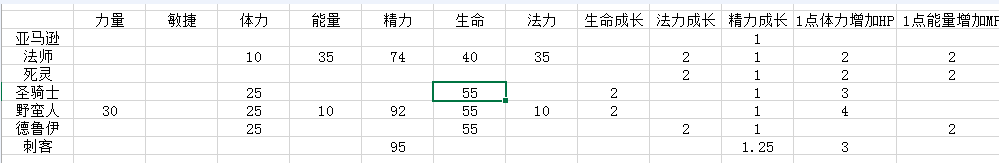
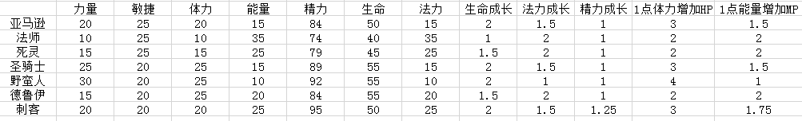

公式会完全还原原著的设计模式，比如伤害实际计算会有各种方面可能存在的加成，这些加成会都保留，所有看起来有的公式可能会稍长。在写出原公式之后，会花点文字解析并最后做个简单的总结。基本上优先从能用可参考的入手，希望大家喜欢。

整体还是会按照游戏深度由表及里，慢慢引出诸多内容。

开始会很简单，后面应该也不会复杂到看不下去。希望能这样一直总结到很多条，起到温故而知新的作用，警示自我以后不会偏离一些初衷用户体验。

这款游戏的经典程度不用多谈了，想必也都玩过，欢迎和谐讨论交流与指正。《暗黑2》无疑是圣经、教科书的级别。深入研究更像是一门无底洞的学术，本着敬畏的心情，尽量不出错的去做好这些个人的心得总结，以供参考。

MMORPG最重要的、最常见的公式部分还是战斗方面。首先从这个最基本的地方提取出几个基本的运算公式，然后逐步展开。

一、输出伤害公式

近战最终伤害=

【（基本伤害x1.5{无形物品}）*（1+武器ed数值/100）+直接最小/最大伤害增加值】
*【1+力量或敏捷/100+非武器ed数值/100+技能ed数值%/100）】
*【（1-技能伤害惩罚/100）】*2{临界一击或者致命一击}
+元素伤害

这个公式无疑是运用最多最广泛的公式，游戏中所有的刷装备，战斗，都是围绕着一次次的攻击进行，每一次攻击都是以这个公式去进行的。

备注：ed数值是增伤的意思，比如武器里面的20%ed，就是增加伤害20%的意思，大多技能也附带这类效果。临界和致命一击就是暴击的意思，伤害翻倍。

公式解析：

游戏设定中，装备分为有形和无形，无形装备的基础伤害或防御会变成1.5倍。普通武器的基本伤害，加成上武器带来的增伤比例与固定增伤，就是武器本身普攻一次的最基础伤害了。这个输出的最基础伤害也就是武器面板上写出来的单手伤害范围A~B。

公式第二行括号中的力量敏捷系数、武器ed、技能ed，分别是角色的一级属性对伤害加成、武器、技能带的一些魔法增伤特效的总百分比加成，跟第一行的基本武器伤害叠乘。

最后第三行再结合技能与光环的增减伤害、暴击伤害得出这一下物理或者魔法伤害的总值、加上冰火毒电方面的元素固定伤害，得到最后的输出。

一把武器的自身伤害是最主要的，这个是基础值，所以整个暗黑的世界中一大部分都会围绕打出一把高伤好武器去进行。得到好武器之后，人物的技能，装备加成，元素伤害，形形色色的能力都参与运算，最后形成了一个设计者想要的输出数值。

游戏最初就给武器设定了固定的数值范围，输出取决于武器的自身能力好坏，武器的级别种类颜色不同，赋予了武器形形色色不同的特性、增伤、魔法元素。其次从公式里也可以看出来，人物的加点方法，对武器的能力输出也有一定比例的影响。比如刺客拿爪，敏捷点数有加成；野蛮人拿各种近战，他的力量点数加的就比别人多，那么输出伤害增幅更大。

除了暴击翻倍，光环增幅等经典的设计，再一次突出了加点模式对人物成长方向的影响，而这个加点完全是玩家自主把控的。

总结公式：

最经典的伤害公式，完全符合现实逻辑，给游戏上限做了大量可扩展的丰富玩法。理解后简单变形大概可以描述成

（武器固伤*武器自带增幅）（+人物点数、所有装备投放的伤害增幅、周围光环与技能的伤害增幅）（-对方技能的减幅衰减）（暴击与否）+元素总伤

在第一条公式最后顺便讲解一些法系的伤害，其实跟物理的类似。只是前面2个括号里，就是武器基础固伤输出的地方，变成法术输出的技能的固定伤害，然后再后续进行光环，装备加成。大体上一样，只是输出模式不同，输出手法和命中方式也不同，后面详述。总之平砍的物理近战大多从武器上去着手得到基础输出，法术的是从释放的技能上着手得到基础输出。法系是攻击必中的，物理的则不是。这就牵扯到命中率的设计。

二、命中率公式

实际命中率=自己命中率/（自己命中率+别人防御力）*[自己等级*2/（自己等级+对方等级）]

假设一个小怪跟你等级一样，你命中率100，小怪防御50，砍他一次命中率其实是2/3。

公式解析：

随着游戏进行，每个角色都有一个自己的命中率属性。法系技能必中，所以物理普攻的命中率才有意义。游戏的防御力的效果就是降低别人的命中率，防御力高了别人不容易集中而已，击中了哪怕你防御力再高伤害也一样。和大多游戏流行的闪避属性叫法不同本质一样，暂时可以把暗黑这里的防御理解成闪避就对了。【暗黑也有伤害减免，不过那个叫抗性，抗性越高伤害减免百分比就越多，当然也分物理抗性魔法抗性，以及冰毒火电抗性。】

后面的等级修正是很有意思很经典的一个设计，自己等级2倍除以双方的等级之和，在之后的游戏中被大量沿用。首先假设双方等级一样，在游戏的过程中很常见的双方等级一样的战斗，那么这后面的等级修正比例结果就是1，如果自己等级是20对方是10，结果就是命中率要乘以4/2+1，你的等级比对方高，命中率还要高一下变成4/3倍。所以虽然大多游戏的装备，加点与面板输出很重要，最终设计者还会加上这个等级来把控一下平衡。记得以前玩过一些游戏，设计玩家等级差距到一定程度，直接增加伤害碾压增伤百分比，低等级不存在逆袭。这样的话直接很有效的削弱或规避了部分潜在的卡级玩法。只要在一些命中或者伤害后加这么个等级修正系数即可。

回到这个公式的命中计算法则，自己命中率够高，别人闪避（防御力）够低，才能有效的击中对面。但是，游戏中防御力的数值有变动范围，固定在了5%到95%的区间内。小怪的防御力防御力再低，你堆叠命中率，也不会超过95%，游戏里除非部分技能才存在百分百命中。

boss后期几千几万的防御，假设有5000防御，那么a/a+b这个公式中，你有5000命中也就是一半概率击中。以游戏经验而已，叠加到七八千以上才会有比较有效的攻击效率。正因为游戏设计了miss的机制，并不是每一次攻击都中，大量的属性和玩法设计才会有用武之地。

设计侧重点根据体验而进行，暗黑的战斗设计大多都是很简洁直观的。在大多情况下，直观的输出多少伤害就是扣血的血量，尤其对于玩家而言。没有什么百分百伤害减免的，生命槽是多少就表示能承受多少伤害。

游戏的减免手法更多的就是通过这个防御闪避，集中在使得对方无法击中来取得一个平衡调整。抗性的计算前期并不多，所以说，输出扣血很直观，伤害是多少数值基本就是掉多少HP，主界面红球的血就表示你有多少的生存力。

而不是某些游戏一样，自己输出多少伤害对比对面HP，很难有一个准确的能否击杀的感受体验。因为防御减伤叠乘算法一大堆，极为复杂，自然就造成了玩家的部分理解成本。

要知道，暗黑中玩家基本没有物理抵抗的，也就是说多少伤害打到身上就是多少，除非那一件暗金免伤甲。怪物也是在中后期才会出现大量的物理抵抗，免伤。有这种能力的暗金怪物的头衔很明显会自带这类称谓，超过100物理抗性直接显示为：隐形的XXXX。

任何一种属性，暗黑中50抗性就是减免一半伤害，计算也是极度的精简漂亮整洁，没有那么多花里胡哨的括号。对处女座而言最舒服的一点。

所以前面说的，游戏中的防御属性，是整个过程玩家都一直绕不开的的话题，况且所有的装备，防御力都是一个最重要的指标。

就游戏本质体验而言，当然是越直观越好，到现在流行的游戏，复杂的公式已经超过玩家的把控能力了，看一眼面板还真不能搞清楚几下打死或者能不能打死。比如LOL，我看一下自己的攻击力，技能输出，点一下对面HP，不计算召唤师技等情况下，带入护甲魔抗计算就已经是要用到 护甲/100+护甲 这个乘法公式了。好在鼠标移过去也都贴心的显示伤害减免百分比，玩的多的情况下大概能有个数，但是还是增加了一个减免计算过程（跟魔兽的减免算法有点像）。

公式汇总：

1、命中值/（命中值+对方闪避）=命中率

【设定数值区间5%到95%】

2、经典的万能等级收益平衡调整：

攻击者等级*2/（攻击者等级+防御者等级）

说完命中率，接着要提到和命中所对应的防御力属性。

三、防御力总值公式

防御力总值=（人基本防御+装备防御+各种地方的直接额外防御）*（1+各种防御百分百加成）

防御力也跟输出、命中一样，也是有几个方面加成得到的。

公式解析：

类似第一条伤害公式，防御这其中主要就包括裸装（也就是人物自身的）防御值，全身装备防御值，光环技能等加成防御值百分比。

自身防御力公式：Base_Defence = [Dex/4]；防御力的自身数值，就是敏捷点数除以4。敏捷加的越高，防御力越高（之前提过其实就是敏捷加的多，闪避数值高，防御的概念这里是闪避）。很经典的一级属性点到二级属性点转化。

装备就是一身装备防御力相加，有固定数值额外加成的也直接加，可以得到一套防御总值。最后这套总值再跟技能光环被动等百分百加成相乘法。很中规中矩的计算方式。

公式汇总：

显示防御力=[（当前人物总敏捷点数/4）+所有装备的防御力总值]*（1+其他各种技能光环对于防御力的加成）

四、谈一下角色的基本属性设定

《暗黑2》的一级属性，如图。随着游戏的升级，每一级升级给你5点点数平均分配在4项能力上，下面说的这几个一级属性、二级属性，在后来的仿暗黑，传奇类，或者mmo游戏里大多沿用了这一经典设定。

可以加点分配的几个属性，对于各个职业有不同的侧重点。4种可加点的属性分别是力量，敏捷，体力，精力。

界面经典的红色蓝色双球代表生命和法力，施法消费法力，挨打消耗生命，生命结束游戏结束，都是arpg基础的设计。

基本属性在作用上设定得很直观，不同的职业里作用也会类似，但是收益系数各有调整。可以这样简单理解：

加力量增加站撸战士近战伤害系数；

加敏捷主要影响命中率闪避率，此外还能增加部分职业比如射手伤害系数；

加体力增加HP跟耐力；

加精力增加MP。

也就是说体力跟现实一样对应到生命和持久跑步的耐力。精力对应施法消耗的魔力。如此玩家玩家也可以用一级属性自由分配影响实际使用的生命类二级属性。是不是非常简单，很好理解。

关于力量敏捷的增伤作用，回头看第一条公式就能理解其中的作用了，数据可以起到一个百分比系数的作用。其实不仅是增伤，其他地方的一些细节，比如在职业装备穿戴平衡设定、引导里也都用到这个一级属性。比如非常经典的：【板甲穿戴需求：力量点数50，法师一般穿不了，法师就穿布甲好了。】

这一部分加点的设计，涉及到1级或者前期的职业体验，可以说是数值框架中最重要的部分，不能说用一套公式一拉就全部得出，所以暗黑的表格很多也是用细微调整，填表类比的方法得出的。这里试着重现一下设计过程。大多游戏初始职业的设定法都类似。

首先明确职业的一些基本侧重点：

野蛮人：近身作战战士，力量高HP高，法力加成少，法力值极低，要生存所以要多出一定的防御敏捷。

法师：远程女法师，体力点少，生命低，法力值高，法力恢复快，MP加成要高。作战方式设定都是远程施法，法力值要远超于野蛮人弓箭手这类物理方式作战的。

刺客：跑动速度快且持久，所以精力要高。生命法力当然都分别落后于战士跟法系，但是敏捷要最高，拟定角色时设定的技能模式决定了必杀蓄力一击一定不能落空。

圣骑士：也是近战战士，生命高，体力加成但是比野蛮人略少，比法师要高。精力也是介于二者之间。但是亮点是盾牌，玩家加点上合理的都绕不开盾牌的防御率公式，敏捷也得略高。

死灵：基本接近女法师，作战模式的区别，生命还是要略微超过女法师，法力略低于女法师。整体四维还是围绕法师微调。

力量因子主要是关系到中后期的力量加成，因为最前期武器只有几点攻击力，加成看不出来的。这里举个例子：

如图武器输出了伤害是4-7，敏捷点20，增伤变成120%，则范围是4*1.2~7*1.2=4.8~8.4

所有游戏里你可以看到攻击伤害，写的就是5-9。就是这个加成幅度。

野蛮人拥有最高的力量，加成方面设定为初期30%，所以填最高的30，圣骑士则设定25，那么刺客、弓箭矛女亚马逊则递减为20%，法师最低到10%近战加成最低，当然力量初始点数就给最低的10即可，其实对于实际作战也没用，高级的盔甲也穿不上。

由于提高等级点数所有人获得固定，后期点数的自由投放取决于玩家，但是最开始的职业设定和区别，关系到最前期的体验，所以还是要完全手动得填好每一个数值。

主要上面举例了，初期的30%自带增伤，也看不出体验区别，新手阶段的武器伤害也控制在了1~5内。砍人这一下的游戏伤害数值的体验，可以说波动范围在立项期间就设定成了严格的【1-999】绝不会崩。

所以新手阶段，这里面主要的体验区别，其实在于生命，生命值的初期设定，需要再结合最低级小怪的攻击力和作战回合拟定。

《暗黑2》这部分的数值调整了肯定无数遍，这里只是大概尝试逆推一下给个思路。

拟定小怪都是80%以上的击中概率，因为开始小怪防御都只有三四点很低的。这个到野外任意作战一次，打开面板都可以看到的。

以野外第一个1级小怪沉沦魔为例，其生命点数为4，攻击1~2。最开始的体验设定都是低级小怪一击必杀，第二轮种类野怪打跟2次就击杀，比如在后面出现的骷髅等都是砍个2次左右，玩过的都知道作战非常简单绝不会卡关。结合野怪数量一般作战3-5个最多。假设没有精英怪的场景，生命值最初期至少也要2*3*怪物数量*秒杀流作战时间，2*3*6=36HP，大致预测计算下来就可以有这么个数字了。游戏设定单挑小怪肯定是无敌，加上有药瓶持续恢复，唯独大量的群殴场景需要多测试。初期1级的场景，50的HP就算比较好的体验了，肯定确保玩家不会死。另外50的初始值，也方便其他职业上下调整。当然这些都是初期填表的尝试值。

大概把数字填上去之后初始职业1级属性会变成这样。

可以说这里面右边的成长加成系数是最主要的，初始值的大小影响不大而且修改方便。但是后面等级高了，加成系数会带入到表格中生成1-100级的数据。加点玩家决定，各职业各种设定系数还有差别，好几百点的投入下，对人物build效果会很大。某些效果接近的职业比如死灵与法师的法力加持，用更小数细微的方法，1.75，1.55，1.25这样去接近。

陆续补充完成后表如图，左侧是一级属性，右侧则是一些成长系数了。用这个简单的小表格，乘以到等级算一下，能得到后期的裸装所有角色的所有能力。一切自身能力都可以推算出来。每个职业属性给一张表格就可以。

这里篇幅问题就不再逆推各种详细数据了，打开游戏1级到5级打几次，其实就可以特别清楚了。这款游戏的前期点数投放，体验上是很完美的，毋庸置疑，都不知道修改了多少次。现实里如果项目中能越早有demo测试的条件就越好，否则只能表格模拟跟脑子里演算了。

这部分决定了基础属性跟成长的属性。游戏里后面很多重要的因素：耐力、跑速、承重、命中率闪避率，到一些高阶伤害计算都跟这个有关，后面还会回头再提到这部分的。实际设定这些数值的时候，推算不太确定的，拍脑袋写下的数据可以先行标记做笔记，后续难免会有调整的。但是回头看暗黑这个简洁的框架模型，就很值得学习吧，最经典的就是最简洁的。下面的篇幅就讲一下跟耐力有关的移动速度问题。

五、耐力与跑步的消耗公式

这一部分在我们大多项目里可能用不到，尤其手游里大多的mmo不会去做这个单位的多种类移速变化系统，无限跑就完事了。目前端游也没见过能做到当年暗黑那个精致度级别的。存在帧数，画面，尺寸的各种技术限制的情况下，给人物设计的移动已经精准到几乎等同现实状况的地步了。这里也只能对最表面可见的跑动与耐力机制给出一个粗浅总结。

游戏中耐力的作用是给跑步消耗用。上一条公式中有写，基础的体力加点能提高耐力，耐力越多跑的越久。毕竟体力这个东西影响生命和跑步持久力简直太好理解了。

耐力总值公式：基本耐力+每一级提高的耐力+分配的体力点加的耐力。这一条很简单。

角色在走路或者不动的时候，耐力会恢复，跑步的时候耐力持续衰减。并且非常合乎逻辑的设定了不同职业不同的衰减速度。《暗黑2》的数值系统经典的根本，感觉还是在于，无数地方都严格根据实际情况去执行合理的运算，真的是不怕麻烦。

耐力衰减的速度越快，跑的时间当然也就越短。出于实际的模拟考虑，很自然的可以联想到所取决于的因素：角色的先天能力不同，装备轻或重，一些来自技能与装备的额外的特别能力的加成。

首先刚刚已经给出了总的耐力公式，那么保持跑动的总时间就等于总耐力/每秒损耗值。

得到损耗公式就OK了。每秒损耗的耐力值由以下公式得出：

25*每个角色的耐力消耗参数*（1+重甲 或中甲 或轻甲的额外加成）*（1 - 装备的减少耐力消耗属性）/256

概括的说，轻巧的职业比如刺客，耐力消耗系数就小，设定30，其他人系数就大，设定为40。

穿的重甲则额外消耗比例为10%，中甲为5%，轻甲不变。

装备那个属于额外魔法属性，游戏的附加属性，帮你减少耐力消耗了，每一秒消耗的就会少。

25后面的这部分数值，就是精准到了的每一帧的耐力消耗。

以刺客的30带入计算，25跟256抵消一下变成除以10，那么也就是30除以10得到3。

所以别看前面他消耗参数是30这么大，假设穿了布甲，但是后面又除以了一个256了，这个系数数值就是中后期微调的关键。可以一次性给所有职业的消耗时间长短做调整系数，觉得跑的时间不够给力不爽，把数字增加就行了。

设定消耗参数是30，才能更方便的给所有职业进行微调，而且可以做到准确得无以复加。

一帧消耗乘以的25（《暗黑2》游戏帧数是25）就得到了1秒内的消耗。对比一下总耐力值，就能很明显的得到一个几秒时间的感受。

前面举过计算例子，我们先去掉所有加成，那么刺客的话1秒钟消耗数值是25*30/256约等于3，初始的耐力翻上面表可以看到，初期大家百来点耐力，跑个30秒也是很合理的了。

可以自己简化一下变成自己的公式：想设定不同职业的，比如刺客就用系数为30，战士40。

直接得出每秒消耗系数/10就行了，或者直接在职业表中填每秒消耗的点数（存在逐个设定调整的就尽量做到可以设定可以逐个职业调整，这种调整比批量改动要便捷保险，不会存在无可改动）。况且现在的游戏已经不存在25帧的限制了。

公式总结：

不同职业在各个场合的表现，分别设定系数，通用计算公式也要设定调整系数。可以逐个调也可以一起跳。暗黑这么简单的公式中就做到了。

其次给装备设定更多的有趣的属性，重量的不同，需求的不同，这些设定的条目越多，后面可扩展的可玩性才越多。真的用不到其实也没关系~

六、耐力恢复公式

25*耐力最大值*（1+额外耐力恢复加成）/256

讲完消耗，自然接着要提一下自动恢复。公式理念一脉传承，这里独立写一下。

上面说过走路跟站立的时候耐力恢复都设计成不一样。站着不动恢复的快，用走的方式也可以恢复，会慢很多。

而且还有2个细节，战力不动但是你在战斗或者被打，耐力不回复；如果你跑到0耐力，变成走路，也一直不回复，至少要有一点耐力以上，才可以切换成走路然后再慢慢恢复。

另外，走路与跑步状态，你的实战检测代入计算的防御力也会不同，可以理解为，一路跑得快，别人就更容易打中你。如果慢慢走，格挡防御什么的都跟站立状态一样。所以高难度一顿乱跑的往往才容易死于飞箭。依旧是出于真实模拟考虑的角度。

站立不动状态的耐力恢复公式：

25*耐力最大值*（1+额外耐力恢复加成）/256

简化一下，假设没有装备带来的额外恢复加速，再把25/256约等于1/10；那么公式其实也就是耐力最大值/10，所以罚站10秒，空了的耐力可以加满。这个就是游戏的节奏设定。通过对256这个系数的调整，可以控制恢复满的时间。

这个公式设定其实结合耐力最大值除一下，发现跟耐力最大值没有关系。也就是说恢复的时间固定。并不是说耐力最大值越大则越快，也是游戏设计理念的体现，任何职业站立10秒差不多就恢复满。

走路状态的公式：上述公式结果除以2，让恢复效率减半。也就是说走的话要花双倍的时间回满。

七、决定人物跑速的具体公式

最终行走速度=基础行走速度【（1+来自技能跑速加成百分比）+（物品跑速加成系数*150/物品跑速加成系数+150）+盾牌重甲的衰减】

说完耐力消耗多少决定跑动时间，也提到了走路和跑步站立的不同恢复，接着引出跑速的具体设计。

这里会开始出现最经典的档位的概念了。时代的产物，引擎的限制。25帧的老游戏无法实现流畅的画面实现，比如攻击速度有那么多种，得到的攻击频率画面一秒内会有无数种节奏，游戏只能25帧，所以只能把跑速，攻速，格挡速度这些变成一个个的数值槛，形成一个个档位。有点歪打正着的感觉，其实反而让数值的追求变得更有意思，产生了一个一个的兴奋点。对于数值设计的兴奋点，一个个玩家努力突破堆积的槛，现在的游戏里应该很常见。

不过暗黑这种基本画面表现形式都存在的档位，在现在的游戏技术里已经不可能再存在了。这里旨在分析其中公式和理念。

游戏游戏分辨率可以有2种选择，640*480和800*600，根据尺寸，假设一下画面用固定间距的横线竖线给予划分，变成一个个用码为单位的立体空间。比如800*600的分辨率，变成高16.7码，宽23码，长分成23份，高宽分成大概17份。

游戏代码内，单位的移动速度就是用这些一个个小长方体来代表距离，代表移动速度。这个运算方式不等同于当下流行游戏的地图坐标方式，地图坐标是固定的地图上的地点。而这方式主要的好处是，可以直接表示到不同单位的距离，移速，对比位置。比如安装一些补丁工具之后，会发现所有单位都有一个固定的距离用码来显示的。另外游戏内的所有技能，攻击距离也都用自己的码去显示，当然移速也是。

想象一下屏幕上这个长方形游戏画面的长宽，长23码宽高17码左右。

游戏内所有角色基础移速都一样。行走是4码每秒，跑步变成1.5倍是6码每秒。

游戏设定了最低行走跑步移速，是1码每秒。因为游戏后期怪物大量的冰冻、诅咒、减速可能让人物几乎无法移动，最低的移速就跟最低的命中率5%一样为游戏体验而设定。

此外移速受到很多因素的影响，比如人物装备的盾牌重量，前面提到的盔甲种类轻重。跟之前提到的耐力衰减一样，移速方面重甲重盾是10%衰减，中盾中甲是5%，轻甲不影响。

最重要的是一个跑速加成系数属性，这个魔法属性的投放跟伤害加成类似，在各种装备饰品中都有，表现为：提高人物跑步速度X%。

人物移动时候，画面刷新受到25帧数的影响，所以实际上效果存在档位。这里因为目前游戏技术不再存在，就不多提，以实际公式分析为主。

最后除了装备技能的特殊效果加速，重甲带来的负重减速，还有敌人的大量特殊效果，比如玩过的都知道冰冻，衰老，都是减速50%。还有其他的一些敌人的冰冻光环，指定数值减速效果。当然怪物单位也有各种各样的加速技能和光环。

行走移速公式：

最终行走速度=基础行走速度【（1+来自技能跑速加成百分比）+（物品跑速加成系数*150/物品跑速加成系数+150）+盾牌重甲的衰减】

技能加成，盾牌衰减很好理解。但是中间物品的一个百分比用的公式形式是150a/a+150。

需要变形一下才好理解。变成a* （150/a+150）如果物品跑速加成是100%（后期不难达到），则带入计算得到的结果是100*15/25，得到一个修正变成了60%。

如果物品跑速加成是10，带入计算得到的是9.3。

有没有想到LOL的护甲减免公式a/a+100？这里的150/a+150正是暴雪典型的追加系数公式。但是这里把常见的100/a+100改成了150/a+150，根本原因是针对的a的范围不同。b/a+b，b的范围越大，影响的值也会越大。可以假设一下一百跟一万的区别就明白了。

这个以可以断定为出于修正对物品带来的跑速加成的影响而留的公式。游戏里物品方面的跑速非常多，后面积累多的话，包括物品鞋子武器，尤其是背包的一堆符文等等。加成高了会非常快，这里做一个a/X+a的衰减也很好理解。

公式总结：

对于我们自身的运用，这个公式跟耐力等计算类似很简单，拿到基础值之后乘以各种系数就好了。唯独中间的那个衰减运用，可以看出高手的严谨。平时预感到溢出的或者很大的数值就多预留系数，以后修改就会很方便，这方面的经验很值得学习。暴雪爸爸的a/a+b用的很多，以小见大。

后面跑速方面的就简单提一下就好。考虑到玩家的体验层级差异，实际游戏中计算是这样设计的：

跑速直接=上述得出的行走速度再+2码每秒

这样的话任何单位的跑速和移速都保持在一个比较平衡和接近的体验上。突然跑起来不会太过突兀。毕竟游戏角色从头到尾大多都在跑步走路。

另外考虑到中后期特殊情况的战斗跑速下限， 当最终行走速度<角色基本行走速度/4 的时候，最终行走速度=角色基本行走速度/4。当最终跑步速度<角色基础跑步速度/4 的时候，最终跑步速度=角色基本跑步速度/4。设定这个下限跟命中率的理念一样，都是为了消除极端体验而定的阈值。LOL里移速也一样存在下限，上限各个范围区间的衰减系数。

八、格挡计算公式

实际格挡几率=盾牌的格挡率*（敏捷-15）/（2*等级）  【不超过75%】

解析：游戏内角色通常可以左手拿盾右手拿武器。拿到盾牌的时候，角色状态会出现一个针对敌人攻击的格挡率。

格挡是游戏内超强的一个属性。格挡动作发生具体表现为敌人攻击被盾牌叮的一声格挡而无效化掉，角色会出现一个几帧的格挡停顿动作。

其中刺客职业装备爪也有几率格挡，算是职业的个性特色。类似这类职业特色设定还有比如：刺客开锁从不需要身上有钥匙、野蛮人可以双手各拿双手剑或斧，圣骑士专属盾不仅加大量四抗、格挡率算法也比别人高等等。

跟之前的耐力系数等一样，在盾牌的使用上，游戏也设定了不同职业的不同效果加成。同一个盾牌，亚马逊、刺客、野蛮人这些物理职业在盾牌基础格挡几率上额外增加5%的格挡几率，圣骑士增加10%，其他人格挡几率不变。

这一条公式实际格挡几率=盾牌的格挡率*（敏捷-15）/（2*等级）中，首先看第一个盾牌的格挡率，是人物最终去参与公式计算的一个格挡率，会显示在装备面板中，这个数值一般不等于盾牌的自带属性，因为还包括其他装备可能存在的加成。

盾牌的格挡率计算方法是，盾牌自身格挡率+盾牌魔法属性中经常奖励的格挡率+其他装备的格挡率加成+来自部分技能的格挡率。得到的这个总的格挡率才会到公式中去参与计算。虽然最终实际格挡率在游戏中无法超过75%，但是这个去参加计算的盾牌的格挡率可以超过75%，也就是说临界值还是只设定在最终的表现结果上。

那么公式理解上我们可以看成：上述一身的总格挡率乘以一个修正系数。该系数自然就是（敏捷-15）/2*等级。假设装备不错刚好一身75%的格挡，敏捷投入的越多，系数越大，最终游戏防御率就越容易增加到接近75%的数值。但是随着等级提高，想维持系数为1需要的敏捷也会越来越多，暂时忽视分子上较小的加成修正（-15）。也就是说大概至少要加2倍*等级的敏捷，才会差不多得到最好的实际格挡几率。

要知道升1级有4点一级属性自由分配。其次格挡体验的核心数值部分设定在了盾牌上，那么在身上这块盾牌数据前期不是特别强力的情况下，想达到比较高的一个实战格挡率，每级的4点一级属性至少一半要投入在敏捷上，这一点也非常容易理解，敏捷设定的初衷就是跟格挡率挂钩了的。至于这个15，属于前期比较重要的一个修正系数。最前期等级只有几级，不把玩家这个二三十左右的敏捷大量降低一下，就会频繁的叮叮叮啦。（因为分母很小很小，而前期裸装就有一定的敏捷了）

所以说公式依旧比较简单，基本上看下自己敏捷，带入算一下就知道格挡的加成情况了。一般随着玩家角色发展，敏捷加的少的话，这个高等级了之后系数衰减就非常多，格挡实际概率会比较低的，这也促使近战玩家多少都要投入一些属性在这上面，并且这部分投入其实跟各种装备对于敏捷的要求也互相呼应。而对于拿着各种专属盾牌的圣骑士，任何加点流派都要最好保证加敏捷点到实际格挡75%，而且圣骑士本身多种技能都会突出盾牌格挡这一块的与众不同。

顺带提一下移动时候格挡率的变化。之前说过跑动时候防御力为0，而格挡概率会变成上面公式的1/3，也就是说结果整体除以3即可，上限也自然的变成了25%。

走路的时候格挡不变，其实这也跟防御力一样往真实合理情况设计。设计师认为玩家走动与站立的时候体验需要安稳，身上关于防御方面的数值并未设定衰减。

公式总结：一身装备总格挡率*（敏捷总加点-前期修正指数）/（等级*2）

【等级升1次得4个自由分配的1级属性点】

九、经验值获取方面的调整公式

这一部分主要内容是：在角色等级过高情况、角色和怪物等级有各种差距的情况下，如何控制玩家升级速度，最后会再提一下经验损失方面的设计。

首先说关于直接打怪经验值的获取，这个很简单，其实就是怪物表格配置这个怪物多少经验，你杀死他就获得这么多。重点是每个怪物的经验要设计多少。

以游戏体验逆推大概如下：衡量好大概各重要等级升级所需时间，根据战斗节奏划分各个期间打怪数量，分配好精英怪、杂兵群与boss，再以杂兵具体数量配置去定各个怪物的经验。其实还是取决于设计师想要的人物升级速度、对怪物投放的控制，也就是抓住人物在不同阶段可以杀多少只小怪去升级的体验。这个体验正是怪物经验表填写的原则。

这一条中提到了怪物的经验值，那么各种怪物详细经验数值如何填先不说，回到主题重点说一下几种常见情况下，《暗黑2》中去控制升级经验进度，优化调整游戏经验的手法。

1、 先说角色升级过程中，和怪物等级有差距的情况。

前面讲到杀怪自动获取经验数值，一般都是指的玩家获取的100%怪物经验数值，也就是说和怪物等级一样你才可以获得这么多。而经常会出现的情况是，等级过高的玩家到低级地图虐怪，或者尤其低等级玩家到高端地图刷怪想飞升。

前中后期怪物的强度和经验成正比，自然高级地图经验非常多，这种做法不处理好显然就会造成玩家等级的不可控。

《暗黑》的处理手法是针对各位情况，用精确的乘法衰减系数去修正玩家与怪物，等级不同时候的经验获取。

第一种情况，特别指出是前期时候的情况。

若玩家等级<25：

①当打的怪物等级比自己低的时候，差距5级包括5以内，经验获取100%；

怪物比自己低6、7、8、9级的时候，衰减系数提高到81%、62%、43%、24%。

也就是等级差距越大收益越少，大于5级的情况经验就开始迅速几乎1级20%的速度衰减了。

最后如果怪物比自己低达到10或者以上，收益只有5%。

②当打的怪物等级比自己高的时候，也就是说去高级地图，5级以内依旧不作处理百分百获得。怪物比自己高6、7、8、9级的时候，衰减系数也是分别提高到88%、68%、36%、15%，同样怪物超过你10或者10级以上，收益只有5%。

第二种情况，玩家熟悉了游戏，度过新手期引导阶段，开始慢慢进入比较完善又漫长的成长期体验的时候。

若玩家等级≥25：

①若玩家打比自己等级低的怪物，衰减情况跟前期衰减节奏一样，同样达到10级之后只有5%；具体系数有差别但是基本一样。

②当怪物等级比自己等级高的时候，衰减系数则直接变成（玩家等级/怪物等级）。

这样区别处理的原因在于：打低等级怪，想虐菜混图肯定有5%衰减，不引导不提倡玩家这么做。实际玩家的行为绝大多都是在挑战高难怪，刷装备。

后期在很高级的地图，也不会给你惩罚衰减到5%，而是你等级越高，同样的强力敌人，系数上等级分子越大经验反而更多。而且不管怎么刷不管挑战多强的敌人，收益都在（自己等级/怪物等级）的范围内，绝不会夸张。比如自己80级刷100级怪物，收益为80%。当然假设1级去打100级的敌人，收益是1%。

为什么前期不用这个公式去通用统一？

因为前期数据过小，需要再精细一些去调控，否则会出问题的。

比如同样是怪物等级比你高，直接用大后期的公式，你1级怪物2级，1级玩家就受到50%的衰减咯。所以其实是后期等级数据放大之后，实际所得就会在可接受的范围内了。

况且，前后等级精细化分开处理，后期修改调整上也比较明朗直观一点。前期感觉节奏不舒服就调前期，是动不到后期的数据的。

2、 《暗黑》后期升级困难最根本的一个因素：高等级下经验获取衰减。

这个衰减很多游戏都会用，甚至说任何游戏的标配：后期难升级。但是很多项目可能做法是，直接在升级所需数值上，表格里填好每级要的经验就直接出现一个超陡的三次方系数了。

《暗黑》不仅后期升级经验是大幅增加，还针对每一级，在其当前经验获取率上加了很大的折扣。具体如下：

前69级并不作处理。一旦达到70级，玩家打怪本身应该获取的经验，都会打上折扣，随着等级提高，折扣越来越多，直到99级实际获取只有5/1024。

在这后期游戏等级期间，

69级获取收益为1024/1024，70级是976/1024，71级是928/1024

70级收益为496/1024,90级收益为61/1024约等于8.8%

直到最后98~99级，收益为5/1024约等于0.5.也就是说本身的每一级极高的升级经验需求，再次直接放大200倍。说天文数字不为过，这里列个数字，最后99级升级要的经验在没被放大100倍的时候是3个亿。

游戏的这个设定意图显而易见：别想满级，后期安心刷装备build人物就对了，等级不是重点，刷装备才是游戏的核心体验。

再说这个游戏里海量的装备可能几年你都刷不全，丰富的技能和玩法也绝对玩不腻，等级其实就是一个游戏大致进度、时间的参考作用，看一下而已。

实际上，等级进行到满足可以穿戴所有装备确实就行了，等级后期不重要，所以哪怕永远没法封顶也是OK的。设计师显然不喜欢去设定300级1000级，那毫无意义。所以加上这种系数衰减无疑是最快的完美主义做法。满级依旧是很好看的100级，只是你达不到。

3、 经验丢失。

普通难度死亡不掉经验，噩梦难度死亡掉这一级升级所需经验的5%，地狱难度死亡掉这一级升级所需的10%。也就是说最高难度，大后期你刷个把月好不容易打满10%的经验，一次死亡就全部清空了，别忘了刚说过等级越高越难获取经验。这个衰减不仅是一种高难度下的等级控制，也算是变相给了刺激的游戏体验。当然玩单机的每次玩之前就随手备份存档吧，不然坚持到最后人会受不了。

95级左右，甚至普通玩家80多级的时候。基本也都是一直在最高难度的副本里，《暗黑》最高难度战斗的设计，再厉害的高手也难保证不死。所以可以说：这个设定才是让玩家后期放弃升级的根本原因：挑战性太大，不死太难。

此外还有一个优化这方面体验的经验挽回设计：死亡后别退出游戏，回去成功捡到尸体，可以拿到75%的已损失经验。选择退出游戏的话经验会消失，当然再进游戏装备还会在主城你可以捡起来。有的情况实在无法拿到尸体装备或者持续多次死亡经验衰减，也只能选择退出放弃了。

十、各等级升级所需经验递增规律

升级设定经验的具体数值，和怪物、副本的投放经验结合起来算才有意义。

这里可以先提一下《暗黑》初始的一批小怪给的经验也就是十几、二十上下，就跟武器的伤害、HP递增、上一篇文章提到的这些基本数值一样，都是从基础可调范围开始慢慢递增。而设计10总比设计1来的好（1无法往下取整数）。变动范围从1规规矩矩递增到后期的999，也算是一个策划确定的数值框架、变动范围。处女座强迫症表示这样设计不仅玩家好懂自己看起来也舒适。

后面在用excel剖析《暗黑》的每一级升级所需经验和递增系数之前，为了理解的透彻，有必要先截取一下整个游戏体验中几个过程中部分怪物给的经验。这样看经验数值表在有对比的情况下，看的时候心中就有一个占比比例，会有一个具体获取难度的衡量。而不是光一堆数字。

列举以下几个怪物：上图建角色出门遇到的第一个沉沦魔，普通难度经验是18，第2个任务boss血鸟是181，第一章最终boss安达利尔是1282，第二章最终boss都瑞尔6007，第五章最终boss巴尔是21万。

上述几个角色在恶魔难度与地狱难度，则大幅提升，因为你的等级到下一个难度会高出很多。第二难度出门第一个小野怪的经验就超过第一幕大boss了。因为游戏中游戏怪物数量有限，想要不同难度下怪物强度线性提高，就得跟着等级走。

表格列举这几个怪物经验清晰一点：

这些怪物的经验都是递增法推算出来，固定每一个手动去填好的。

知道了出门小怪的起始经验和其他难度下最终boss的经验。接着看一下每一级升级经验，然后逆推，游戏每次升级时间基本就固定了。

游戏内可以查看到每一级的具体数值，列到excel中，把经验数据随着等级提升，折线图分布一下，呈阶段式线性上升，跟《暗黑》常见的“不同等级段下分别精细调控”的手法基本也吻合。分阶段性直线上升，每一级每一个阶段都是后面数据的参考与基础，在此基础上设定阶梯式提升。点击图标试几个公式就可以逆推出固定的增长系数了。

篇幅问题每一级不能都仔细分析，截取前期和后期阶段，就很明显可以看到：是很简单的固定系数乘法让升级经验值在提升。最后一列的与上级比，就是等级经验的固定增减系数。开始几级特别手动设定，后面前期大多是1.25，很快中后期变成固定的1.09。

前三十级经验图如上图，后几十级提高如下图，可以看到在上一级的基础上，都阶段设定了一个稳定的增长系数了。

后期每一级都比之前一级难大约10%，或许这个0.1倍就是《暗黑2》设定升级体验的初衷。但是前面一条里说道，大后期针对满级的控制问题，在每一级都额外加上了变态的高等级衰减系数，甚至后面高达到5/1024这个数据。

这个增幅系数跟第九大条公式的第二点，《暗黑》后期升级困难最根本的一个因素：高等级下经验获取衰减。2者前期后期双管齐下可以共同把控游戏内升级的数值。前者可以让整体大多时候都呈现一个稳定的提升，比如一直到70级都非常稳定；后者负责后期，可以让高等级下直到100级的升级速度，预期体验定在自己的一个控制范围内，不会存在疏漏。

十一、组队模式的经验获取计算方式

【a+a*（n-1）/2）】*【1+89/256*（结盟者-1）】*（玩家等级/队伍内所有玩家总等级）*【1+神殿buff的50%+装备加成X%】

《暗黑2》里组队经验这方面是很经典很合逻辑的算法，后面大多mmo都直接沿用了。

时代不同，部分概念现在不适用了，当时的局域网模式玩法跟现在的mmo服务器在线人数有巨大差别。《暗黑》中，加入某个玩家的游戏（房间），玩家世界中的怪物就会变强获取经验就变多。所以总公式中首先会计算服务器内人数对怪物经验获取的影响，然后才是组队的一些分成问题。

第一步【a+a*（n-1）/2）】

首先说游戏内共同作战的玩家数量，可以想象成你开了一个局域网，有多少个玩家加入你的“小世界”中。

在原有单人100%打怪，获取的经验设定为的a的基础上，原著的写法里，人多了之后公式是：【a+a*（n-1）/2）】

若该游戏世界里现在有n人，则队伍总获得经验变成a+a*（n-1）/2，也就是说人数减1再除以2，这个倍数就是当前游戏里拿到的额外的经验倍数。

3个人额外多1倍，10个人额外多4.5倍；也就是2个人只是变成1.5倍，3个人变成2倍，4个人变成2.5倍，5个人变成3倍，10个人变成5.5倍。当然怪物也相对会变强，主要体现在HP中，对应倍数增加。也很符合最开始提到的游戏的伤害输出=HP的概念原则。这里也不是直接去乘以人物倍数，可以看出人数越多，一同输出某个怪物是变得简单的，经验也不是直接多10个人就给你10倍。

然后第二步，【1+89/256*（结盟者-1）】

游戏设计了结盟的经验计算。鼓励玩家结成同盟，有同盟后经验的获取也是有对应增加的。这个增加直接在上一步基础上继续乘法运算。

要提一点设计：上一篇讲到游戏的屏幕范围，yard的概念，这个尺寸距离单位当时说不仅关系到跑速耐力等，其相对位置的距离运用也关系到经验的有效分配、技能波及范围之类的问题。

在这里，怪物死亡，是有一个有效经验可分享范围的，计算怪物和玩家之间即时的距离单位，在范围内的玩家才可以参与分享经验。暴雪设定的有效范围是2个自然屏幕范围，可以说基本会涵盖区域内所有的作战玩家了。

所以有结盟者，会在第二步之后，再参与第三步的额外加成。

具体的公式结果是变成【a+a*（n-1）/2）】*【1+89/256*（同一个区域中，死亡怪物可分配经验范围内的结盟玩家数-1）】

乍一看系数89/256似乎不好理解，我们大概算一下89除以256其实就可以了，这个数值结果约等于三分之一，后面这个结盟系数可以完全大约简化成（人数-1）*0.3，也就是说1个人的话，很完美的出现了0加成，2个人就是总经验再多0.3倍，3个人递增为0.3*2倍。暴雪设计，每再多一个结盟者，打怪实得经验就多0.3倍左右。

第三步，（玩家等级/队伍内所有玩家总等级）就是按等级分配了。

上述的总经验算出来之后，系统按照每个玩家等级给予对应的所得经验。

公式为

所得经验=（玩家等级/队伍所有玩家总等级）*【a+a*（n-1）/2）】*【1+89/256*（结盟者-1）】

这个公式非常的经典，结合之前的经验分配机制。基本上不仅保证了玩家的组队收益，大号带小号，新号飞升等问题都得到了保证。等级越高收益收益越多，等级越低也不会夸张得飞升，但是组队总是比你单人多的。自己等级除以队伍总等级，是不是非常简单好用。

最后一步【1+神殿buff的50%+装备加成X%】是一些额外加成buff对经验的影响。由于对经验要精准的可控，这个加成必然就投放的少，主要包括少量护身符，限时经验神殿等。神殿野外随机小几率出现，对经验倍率加成为50%，物品有指定的百分比X。那么最后带入计算，玩家组队与结盟获得的总经验就是

（玩家等级/队伍所有玩家总等级）*【a+a*（n-1）/2）】*【1+89/256*（结盟者-1）】*【1+神殿buff的50%+装备加成X%】

公式总结：这个年代的mmo不存在局域网加入调整怪物强度了。与时俱进简化成：（个人等级/组队总等级）*经验*（1+结义加成）

注意，结义系数设定的可控一些，X/256就是典型的可以学习照搬的系数。比直接拍1.5，2、3什么的科学的多。

十二、经验环节的补充：宠物单位经验设计

宠物某等级的总经验=等级?×(等级+1)×M

宠物、召唤物这类系统，有自身的一套完整设计，并且养成、作战方式、包括等级提升都跟人物不同。如果只是照搬人物的系统，暴雪也绝对不会在后续资料片增加雇佣兵这个系统了。宠物在游戏中名称叫雇佣兵，但凡玩过的同学应该还对第一章的女弓箭手、第二章的黑人枪兵有印象。

雇佣兵的详细设定系统后面会继续逐步讲解的，这里只提一下跟经验有关方面的设计。

当游戏内加入宝宝（宠物、雇佣兵）之后，不得不考虑的就是经验方面的影响或分成。玩家通常也会有这方面的疑惑，就是宠物杀死的怪物经验我是不是没有了。我杀的经验如何自动或手动的去分配给宠物。现在流行的一些游戏，玩家能自主分配经验值给各种宠物选择性养成。

首先讲一下《暗黑2》针对雇佣兵与主角相关的经验方面，其基本设定原则：

1、雇佣兵杀敌经验完全会给玩家，跟玩家杀的一样，所以不用担心损失的，跟你自己打的一样；

2、你击杀的怪物经验会有1/3给雇佣兵；

3、另外召唤物比如死灵法师最典型的那些骷髅，击杀后玩家人物当然也是百分百获得怪物经验，而雇佣兵在这部分获得比例跟第二条一样是1/3。

（后面的篇章会提到这几个同时存在的己方单位，雇佣兵和召唤物的一些光环，加成，影响好装备掉落率的MF数值，在结算时候他们之间的影响。）

雇佣兵的升级跟人物不同，相对而言整体数值都是系数加公式直接跟便捷得拉出来的。调整的影响因素：游戏设定了一个升级因子M，这个因子可以在表格内控制填写。

设定因子越大，公式下每一级所需经验自然越多，升级越慢。

设计好处在于，不同难度不同时期，因子改一下升级速率就变了，公式也非常直观便于调整。

公式如下：

达到某等级的总经验=等级?×(等级+1)×M， 游戏中，最常用的初始M参照数值取的是100，当然就是第一个场景的第一种雇佣兵了。就以100举例，等级10级的时候，需要经验就是100*11*100，为11万经验。11级要121*10*100=12万一千，那么10级升级到11级需要的经验一减，就是1万1。对照之前的各自怪物经验，就可以很清楚要击杀多少什么样级别的怪物了，实现配置的控制区间。

M这个因子根据不同难度，不同地区的雇佣兵，给的数值不一样，越高难度数值会越高，也就是说升级越难。然而不同难度不同地区的雇佣兵其性能，光环差异，特色、作战能力成长属性又各不相同。

具体成长系数方面，第一幕第一个雇佣兵设定100，最高难度地狱最强的野蛮人设计的是140。这里面就很直观的能在乘法公式里面看出同等级下他们升级的难度的差别了，而且可以精确计算到各个级别的具体差距。

不同雇佣兵的升级因子参数设定的不同，导致《暗黑》中有一个很明显的设定：初始难度最早得到的雇佣最容易升级，而且一直带着会显得更强力，他们他们到大后期属性是优于最高难度直接雇佣的那种雇佣兵的。

大概是设计师起初希望玩家把一开始的雇佣兵一直带着的原因。然而不同难度设计了各种不同的特色，所以实际上各种场合下职业的搭配上，还是只能根据需求去选取合适的雇佣兵。

另外不同难度不同场景地图下，根据玩家等级不同，雇佣到的雇佣兵初始等级也有一个变动范围。基本等于玩家游戏进程达到这里之后的实际等级。这个时候玩家的等级雇佣兵等级，也自然跟野外怪物强度，都成正比。

公式总结：每一级需要总经验=等级?×(等级+1)×M。调整M可以调整升级难度。

未完待续。